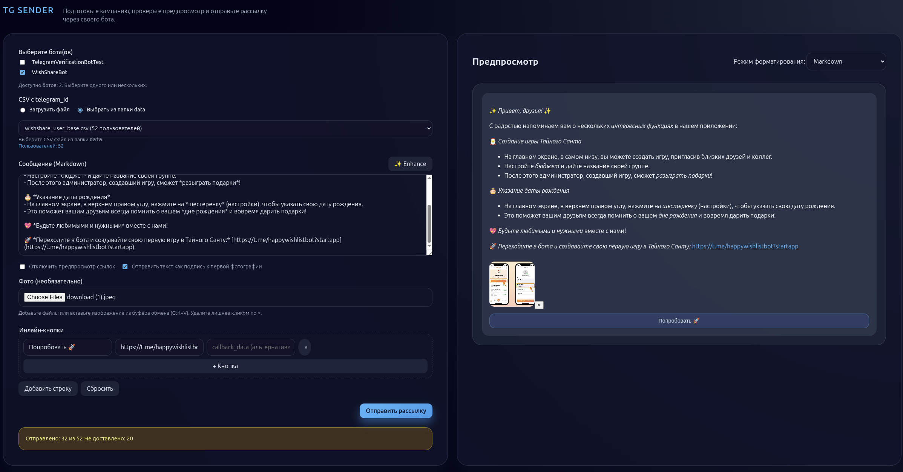

# Telegram Broadcast Studio



Полноценный инструмент для подготовки и отправки персонализированных рассылок через Telegram-бота. Включает:

- Python-бэкенд (FastAPI) с REST API для предпросмотра и массовой отправки сообщений пользователям.
- Веб-интерфейс с редактором Markdown, предпросмотром в стиле Telegram, визуальным конструктором инлайн-кнопок, загрузкой CSV со списком получателей и управлением вложениями.
- **Управление несколькими ботами** через файл `bots.yaml` с возможностью отправки через несколько ботов одновременно.
- **Выбор CSV файлов из папки data** с отображением количества пользователей.
- **Отправка нескольких фото как media group** с caption к первой фотографии.
- **AI-улучшение текста** с сохранением форматирования Telegram.
- CLI-скрипт для рассылок из терминала.
- Docker/Docker Compose конфигурацию для быстрого запуска.

## Содержание

1. [Быстрый старт](#быстрый-старт)
2. [Структура проекта](#структура-проекта)
3. [Запуск через Docker](#запуск-через-docker)
4. [Локальный запуск (без Docker)](#локальный-запуск-без-docker)
5. [Использование веб-интерфейса](#использование-веб-интерфейса)
6. [CLI-рассылка](#cli-рассылка)
7. [Конфигурация ботов](#конфигурация-ботов)
8. [Формат CSV](#формат-csv)
9. [Переменные окружения и конфигурация](#переменные-окружения-и-конфигурация)
10. [Тестирование и отладка](#тестирование-и-отладка)

---

## Быстрый старт

```bash
git clone <repo-url>
cd telegrammessagesender
docker compose up --build -d
```

Откройте `http://localhost:8000/` — появится веб-студия рассылок. Бэкэнд обслуживает:

- `GET /health` — проверка статуса
- `GET /api/bots` — список ботов из `bots.yaml`
- `GET /api/csv-files` — список CSV файлов из папки `data/` с количеством пользователей
- `POST /api/preview` — предпросмотр (возвращает исходные данные)
- `POST /api/enhance` — улучшение текста сообщения с помощью AI
- `POST /api/send` — отправка сообщений по списку chat_id (поддерживает несколько ботов и media group)

## Структура проекта

```
backend/
  app/
    main.py             # FastAPI-приложение
    telegram_sender.py  # Логика отправки сообщений, фото и inline-кнопок
  requirements.txt

frontend/
  index.html            # SPA-интерфейс рассылки
  assets/
    app.js              # Логика UI: предпросмотр, загрузки, запросы
    styles.css          # Оформление (минималистичный тёмный дизайн)

scripts/
  broadcast.py          # CLI-утилита для рассылки

data/                   # CSV-файлы с chat_id (монтируется в Docker как volume)
bots.yaml              # Конфигурация ботов (имя и токен)
Dockerfile
docker-compose.yml
README.md
```

## Запуск через Docker

1. Собрать и запустить:

   ```bash
   docker compose up --build -d
   ```

2. Проверить здоровье:

   ```bash
   curl http://localhost:8000/health
   ```

3. Остановить:

   ```bash
   docker compose down
   ```

**Особенности Docker-конфигурации**

- Порт приложения: `8000`
- Каталог `frontend/` подключен в контейнер только для чтения, поэтому изменения в HTML/CSS/JS применяются без пересборки.
- Файл `bots.yaml` монтируется в контейнер, можно обновлять ботов в рантайме.
- Папка `data/` монтируется в контейнер, можно добавлять/обновлять CSV файлы в рантайме.
- Healthcheck пингует `/health`.

## Локальный запуск (без Docker)

1. Создайте виртуальное окружение:

   ```bash
   python -m venv .venv
   source .venv/bin/activate
   pip install -r backend/requirements.txt
   ```

2. Запустите сервер:

   ```bash
   uvicorn backend.app.main:app --reload
   ```

3. Перейдите на `http://localhost:8000/`.

## Использование веб-интерфейса

Фронтенд выполнен в минималистичном стиле:

- **Выбор бота(ов)** — если в корне проекта существует файл `bots.yaml`, можно выбрать одного или нескольких ботов из списка. Иначе вводите токен вручную (скрыт под маской).
- **CSV с telegram_id** — два режима:
  - **Загрузить файл** — загрузите CSV файл с компьютера (см. формат ниже). При отправке файл перечитывается с диска, чтобы учитывались последующие изменения.
  - **Выбрать из папки data** — выберите CSV файл из папки `data/`. В списке отображается количество пользователей в каждом файле. При выборе файла показывается точное количество пользователей.
- **Сообщение (Markdown)** — редактируйте текст, справа сразу обновляется предпросмотр. Поддерживаются `Markdown`, `MarkdownV2`, `HTML` и «Без форматирования». Кнопка **✨ Enhance** использует AI для улучшения текста с сохранением форматирования Telegram.
- **Флажки** — отключение предпросмотра ссылок, отправка текста как подписи к первой фотографии.
- **Фото** — загрузка через диалог, drag and drop, а также вставка изображений из буфера (`Ctrl+V`). Каждое прикреплённое фото можно удалить кликом по `×`. 
  - Если загружено несколько фото, они отправляются как **media group** (в одном сообщении).
  - Если выбрана опция "Отправить текст как подпись к первой фотографии", текст становится caption к первой фотографии в media group.
- **Инлайн-кнопки** — визуальный конструктор. Кнопки и строки не обязательны. Перед отправкой клавиатура нормализуется: каждая кнопка отправляется отдельной строкой и в Telegram отображается вертикальным столбиком. При отправке с media group кнопки добавляются к последнему фото.
- **Результат отправки** — всегда указывается итог: сколько доставлено из общего числа. Частичный успех подсвечивается жёлтым блоком со списком ошибок (например, если chat_id не найден). При отправке через несколько ботов показывается статистика по каждому боту.

## CLI-рассылка

Скрипт `scripts/broadcast.py` использует общую логику `TelegramSender` и подходит для автоматизации:

```bash
./scripts/broadcast.py \
  --token "<BOT_TOKEN>" \
  --csv data/users.csv \
  --message-file message.md \
  --photo cover.jpg \
  --inline-keyboard buttons.json \
  --attach-message-to-first-photo
```

Ключевые параметры:

- `--message` или `--message-file` — текст в Markdown/HTML.
- `--photo` — можно указать несколько раз. При отправке нескольких фото они объединяются в media group.
- `--inline-keyboard` — JSON-строка или путь к файлу вида:

  ```json
  [
    [{"text": "Открыть сайт", "url": "https://example.com"}],
    [{"text": "Связаться", "callback_data": "contact"}]
  ]
  ```

  (В CLI сохраняется исходная структура строк; для вертикального отображения укажите по кнопке в каждой строке.)
- `--parse-mode` (`Markdown`, `MarkdownV2`, `HTML`, `None`)
- `--disable-preview`
- `--attach-message-to-first-photo`
- `--extra-api-params` — JSON с дополнительными параметрами `sendMessage`
- `--dry-run` — только показывает количество получателей

## Формат CSV

Поддерживаются два сценария:

1. Первый столбец содержит chat_id (без заголовков).
2. Есть строка заголовков с колонкой `telegram_id` (регистр не важен).

Пример:

```csv
telegram_id
123456789
987654321
```

или

```csv
123456789
987654321
```

Пробелы обрезаются, пустые строки и некорректные ID игнорируются. Для успешной доставки пользователь должен начать диалог с ботом (нажать `/start`).

### Использование CSV файлов из папки data

CSV файлы можно размещать в папке `data/` и выбирать их из веб-интерфейса. При выборе файла автоматически отображается количество пользователей в файле. Файлы в папке `data/` доступны в контейнере через volume mount, поэтому их можно обновлять без перезапуска контейнера.

## Конфигурация ботов

### Файл bots.yaml

Создайте файл `bots.yaml` в корне проекта для управления несколькими ботами:

```yaml
# Telegram Bots Configuration
bots:
  - name: "My Bot"
    token: "123456789:ABC-DEF1234ghIkl-zyx57W2v1u123ew11"
  - name: "Another Bot"
    token: "987654321:XYZ-ABC5678jKlMn-zyx57W2v1u123ew22"
```

Если файл существует, в веб-интерфейсе появится возможность выбрать одного или нескольких ботов из списка. Можно отправлять рассылку одновременно через несколько ботов.

## Переменные окружения и конфигурация

Переменные окружения можно задавать через системные переменные или через файл `.env` в корне проекта.

### Основные переменные

| Переменная            | Значение (по умолчанию) | Описание                           |
|-----------------------|-------------------------|------------------------------------|
| `TZ`                  | `UTC`                   | Часовой пояс контейнера (Docker)   |
| `UVICORN_HOST`        | `0.0.0.0`               | Настраивается в Dockerfile через CMD |
| `UVICORN_PORT`        | `8000`                  | Порт сервера                       |

### Переменные для функции Enhance (улучшение текста)

| Переменная            | Значение (по умолчанию) | Описание                           |
|-----------------------|-------------------------|------------------------------------|
| `OPENAI_API_KEY`      | -                       | **Обязательно.** API ключ для OpenAI или OpenRouter |
| `OPENAI_BASE_URL`     | `https://api.openai.com/v1` | Базовый URL API (для OpenRouter: `https://openrouter.ai/api/v1`) |
| `OPENAI_MODEL`        | `gpt-4o-mini`           | Модель для использования (например, `anthropic/claude-3.5-sonnet` для OpenRouter) |

### Пример .env файла

Создайте файл `.env` в корне проекта:

```bash
# Для OpenAI
OPENAI_API_KEY=sk-your-openai-api-key-here

# Для OpenRouter (раскомментируйте и используйте вместо OpenAI)
# OPENAI_API_KEY=sk-or-v1-your-openrouter-api-key-here
# OPENAI_BASE_URL=https://openrouter.ai/api/v1
# OPENAI_MODEL=anthropic/claude-3.5-sonnet
```

Если требуется ограничить CORS, отредактируйте списки в `backend/app/main.py` (по умолчанию разрешены все origin).

## Тестирование и отладка

- Проверка синтаксиса Python:

  ```bash
  python -m compileall backend scripts
  ```

- Тестируйте рассылку на тестовом списке (в `data/test_users.csv`).
- При частичной доставке проверьте логи контейнера (`docker compose logs -f app`) — там указаны chat_id и текст ошибки от Telegram API.
- Для UI-автотестов можно подключить Playwright (поддерживается MCP-интеграция в Cursor).

---
